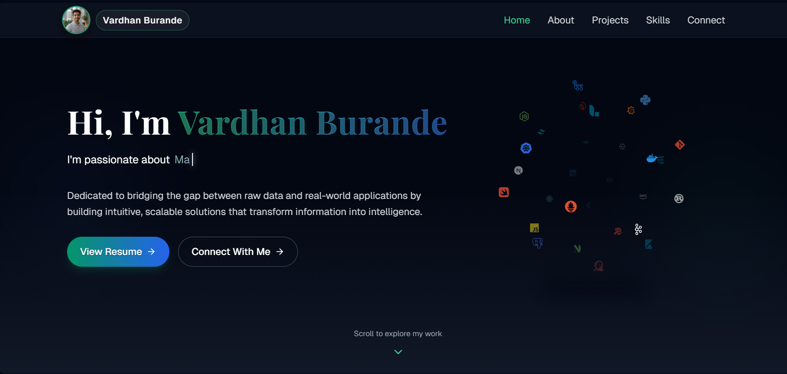
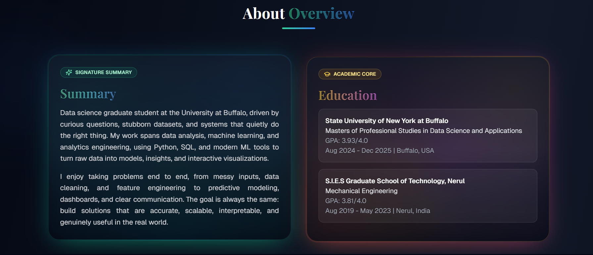
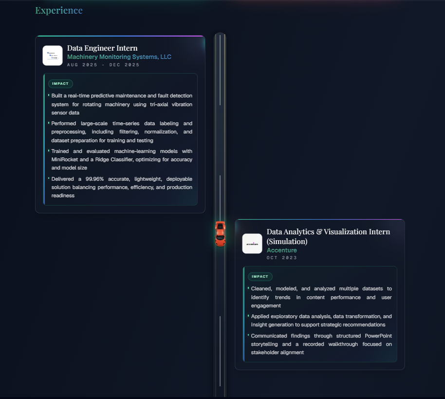
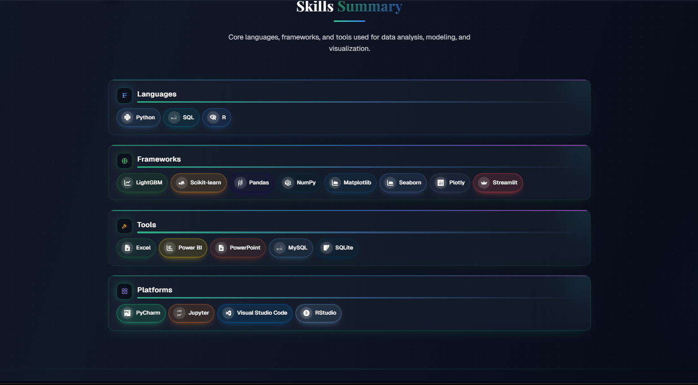
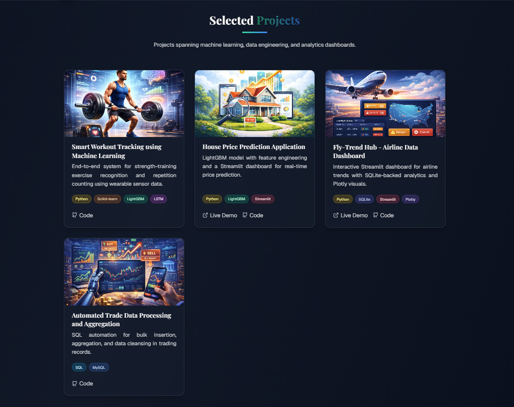

# Vardhan Burande | Data Science & Analytics Portfolio

[](https://nextjs.org)
[](https://react.dev)
[](https://www.typescriptlang.org)
[](https://tailwindcss.com)
[](LICENSE)

Data science and analytics portfolio focused on end-to-end data workflows, machine learning, and clear, actionable insights.

## Screenshots

<div align="center">
  
</div>

<div align="center">
  
  
</div>

<div align="center">
  
  
</div>

## Highlights

- Home section with rotating focus areas in data engineering, machine learning, and analytics.
- About section covering academic background, experience, and applied data work.
- Project showcase featuring ML pipelines, dashboards, and data engineering automation.
- Skills summary grouped by languages, frameworks, tools, and platforms.
- Connect section with direct links to GitHub, LinkedIn, email, and phone.

## Featured Projects

- Smart Workout Tracking using Machine Learning
- House Price Prediction Application
- Fly-Trend Hub - Airline Data Dashboard
- Automated Trade Data Processing and Aggregation

## Tech Stack

- Next.js 15 + React 19
- TypeScript
- Tailwind CSS
- Framer Motion, GSAP
- Lucide, React Icons, React Icon Cloud

## Local Development

- Node.js 20+

```bash
npm install
npm run dev
```

## Configuration

Portfolio content lives in `src/app/config`:

- `src/app/config/index.ts` for site metadata and section text
- `src/app/config/projects.ts` for project data
- `src/app/config/skills.ts` for skills
- `src/app/config/socials.tsx` for social links

## Project Structure

```
portfolio/
├── src/app
│   ├── config
│   ├── components
│   ├── sections
│   └── globals.css
└── public
```

## License

Licensed under the Apache License 2.0. See `LICENSE` for details.

## Contact

- GitHub: https://github.com/vardhan1515
- LinkedIn: https://www.linkedin.com/in/vardhan-burande-a9a14a261
- Email: mailto:vardhanburande2002@gmail.com
- Phone: tel:+17169949110
